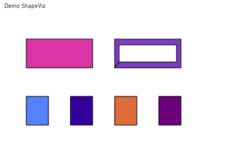
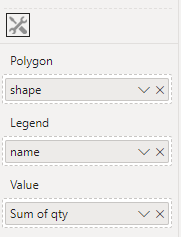

# Shape Visual - a demo custom visual for Power BI

This is a quick demo visual that will display polygonal data with either categorical colours or color based on a value field.



Nothing here is polished, but it does work.

Create a datasource with the WKT polygon in a column, at least one data column, and optionally a category column.

e.g.
name|qty|shape
----|---|-----
x01|11|POLYGON((10 10, 20 10, 20 20, 10 20, 10 10))
x02|2|POLYGON((30 10, 40 10, 40 20, 30 20, 30 10))
x03|13|POLYGON((50 10, 60 10, 60 20, 50 20, 50 10))
x04|10|POLYGON((70 10, 80 10, 80 20, 70 20, 70 10))
x11|3|POLYGON((10 30, 40 30, 40 40, 10 40, 10 30))
x13|20|POLYGON((50 30, 80 30, 80 40, 50 40, 50 30),(52 32, 52 38, 78 38, 78 32, 52 32))


## Building
1. Install powerbi-visuals-tools with `npm install -g powerbi-visuals-tools@latest` (more info [here](https://learn.microsoft.com/en-us/power-bi/developer/visuals/environment-setup))
2. Clone this repo `git clone https://github.com/unique-pear486/shapeviz`
3. Install the npm libraries 
   ```bash
   cd shapeviz
   npm install
   ```
4. Build the visual with `pbiviz package`

## Using
1. If you have imported the table above as a data set
2. Import the visual from the file (either build it as above, or download the .pbiviz file from GitHub releases)
3. Add the "shape" column to the visual under "Polygon"
4. Add a numerical measure under "Value"
5. (Optionally) add a category column under "Legend"


